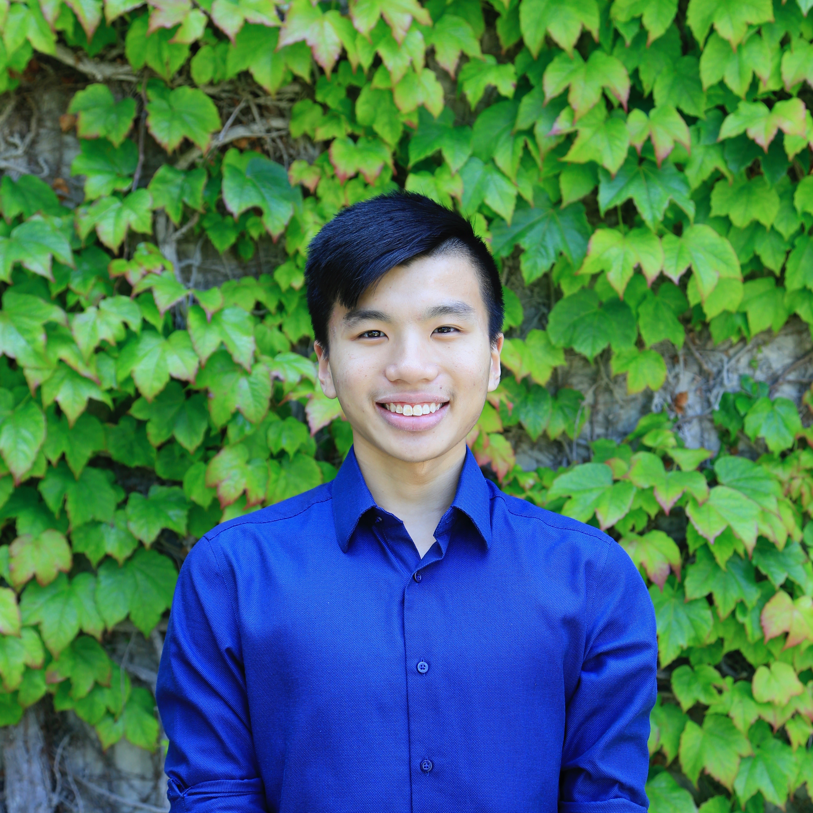

# Officers

Please email us at [sums@ucsd.edu](mailto:sums@ucsd.edu) for general inquiries.

## 2019-2020

    </img>

### President

**Kin Yau James "James" Wong**  
[k1wong@ucsd.edu](mailto:k1wong@ucsd.edu)  
*Mathematics - Computer Science*  
*3rd Year, Revelle*

> I joined SUMS because I am passionate about engaging all people in mathematics regardless of their background.
> I also want to be in an environment where I can share my interests in mathematics with other people.
> As the President, I hope to maintain a healthy environment for everyone involved in mathematics.
> I also hope to establish stronger connections with others, and see more interaction between professors, graduate, and undergraduate students in mathematics.

